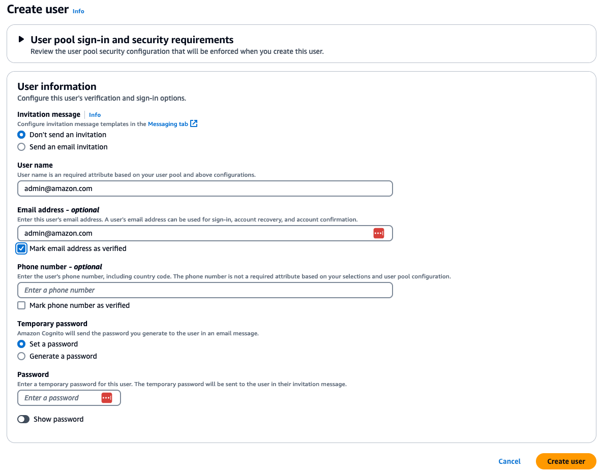

# Amazon Bedrock Token Profiling for Multi-Tenant Environments

This repository provides a scalable and cost-effective solution for implementing token profiling in multi-tenant environments using Amazon Bedrock. It addresses the unique challenges of multi-tenancy while offering robust usage and token cost tracking mechanisms.

## Key Features

- **Scalable Architecture**: Designed to handle multiple tenants efficiently.
- **Cost-Effective**: Optimized for minimal resource usage without compromising performance.
- **Granular Usage Tracking**: Detailed token usage and cost tracking for each tenant.
- **Transparent Accountability**: Clear insights into resource consumption per tenant.

## Purpose

This solution aims to:

1. Provide SaaS providers with accurate usage data for fair and competitive pricing.
2. Empower businesses to offer tailored pricing models based on actual resource consumption.
3. Ensure transparency and accountability in multi-tenant AI/ML applications.

Whether you're building a SaaS platform or managing a multi-tenant environment, this repository offers the tools and best practices to effectively implement token profiling with Amazon Bedrock.

## Architecture


## Getting started

### Deployment
1. Install the required module
```
cd ./foundation-models-token-profiling-for-multi-tenant-on-amazon-bedrock/amazon-bedrock-token-profiling-core
pip install -r requirements.txt
```

2. Edit ./setup/configs.json to type the STACK_PREFIX
```
[
  {
    "STACK_PREFIX": "<type your prefix here>",
    "BEDROCK_ENDPOINT": "https://bedrock.{}.amazonaws.com",
    "BEDROCK_RUNTIME_ENDPOINT": "https://bedrock-runtime.{}.amazonaws.com",
    "BEDROCK_REQUIREMENTS": "boto3>=1.34.94 awscli>=1.32.94 botocore>=1.34.94",
    "LANGCHAIN_REQUIREMENTS": "aws-lambda-powertools langchain==0.1.16 pydantic PyYaml",
    "PANDAS_REQUIREMENTS": "pandas",
    "SAGEMAKER_ENDPOINTS": "",
    "VPC_CIDR": "10.10.0.0/16",
    "API_THROTTLING_RATE": 10000,
    "API_BURST_RATE": 5000
  }
]
```

3. Deploy the core components. Make sure this EC2 have required permission for deployment. After deploy successfully, your API URL will show in the output. Please record it for later use. 
```
chmod +x deploy_stack.sh
./deploy_stack.sh
```
You could also get the output result from Outputs tab in CloudFormation stack, including API Gateway URL, Cognito User Pool ID, and Cognito Application Client ID.


The core components includes the following resources:

* VPC endpoints and networking configuration
* IAM role
* Cognito user pool with app client
* API gateway
* Lambda layers and functions
* DynamoDB table
* EventBridge scheduler

4. Deploy the demo website components
```
cd ./amazon-bedrock-token-profiling-for-multi-tenant/amazon-bedrock-token-profiling-web
chmod +x deploy_stack.sh
./deploy_stack.sh
```
The demo website components includes the following resources:
* Cloudfront distribution
* S3 bucket for web hosting
* A demo website

You could get the URL of demo website from the Outputs tab in CloudFormation stack and open this link directly.


5. After deploy successfully, you can navigate to [API Gateway Console](https://us-east-1.console.aws.amazon.com/apigateway/main/apis?api=unselected&region=us-east-1) to check your API, the name would be  **[your stack prefix]_bedrock_api_gw**. You can found there are three resources for this API Gateway: invoke_model, cost_track_manual and ddb_cost_retrieval.  


6. Navigate to the [Cognito User Pool](https://us-east-1.console.aws.amazon.com/cognito/v2/idp/user-pools?region=us-east-1), you should see a user pool be created and named with your prefix in the beginning.


7. Click into the cognito user pool record its user pool id, app client id for later used. The information of app client id will be in App integration tab in Cognito.


8. Create the users by yourself. You need to create several general users for differnt tenants and one admin user id with the email `admin@amazon.com` for later demo used. Remember to click "Makr email address as verified" during create user. For example, if we want to test two different tenants, this step will be repeated three times including admin user. You could randomly use the temporary password because this password will be reset later.



9. The confirmation status of each user should be updated from status "Force change password" to "Confirmed". The following command will be used to reset the status. This step will be repeated to every users, and you need to remember each user's password.
```
aws cognito-idp admin-set-user-password --user-pool-id <Cognito User Pool ID> --username <Cognito User Name> --password <Cognito User Passowrd> --permanent
```


10. You could check the "Confirmation status" field in Cognito UI and make sure the status of every users.


11. Finally, the status of all users is "Confirmed".


12. Navigate to the [CloudFront Distribution](https://us-east-1.console.aws.amazon.com/cloudfront/v4/home?region=us-east-1#/distributions), you should see a distrubution be created and named with your prefix in the beginning. 

13. Copy the distribution domain name then open in your browser. You can see the demo website.


14. On the demo website, click the **Credential** button on the top-right. Then field your user pool id, app client id and api url. Then click save.


15. Expand the action menu on the top-left. Select **sign in** to login. You will see some basic information if login successfully. If you got some error messages in the first time to Sign in after deployment, you could try again due to cold start of Lambda functions.


16. You can type the question in the text field to check the response.


17. If you would like to check the cost for each user, you need to login as admin user.

18. As you login as admin, you can see the **Manually aggregate the metrics** and **Check the cost** buttons.


19. Click **Manually aggregate the metrics** button to aggregate the cost, you should see the "Calculation Finished" message.


20. Click **Check the cost** button to check the results.


### Experiance with API

1. You could use [Postman](https://www.postman.com/downloads/) or use [curl](https://github.com/curl/curl) command for experiancing.

2. Let's try the **invoke_model** api first.  For this solution, you can invoke two models from Amazon Bedrock by the following model ids.

- amazon.titan-embed-text-v1

- anthropic.claude-3-sonnet-20240229-v1:0


3. Prepare the POST request on Postman and paste the API URL. The URL should be `https://{API URL}/invoke_model?model_id={model_id}`.

4. Get the value of **IdToken*** from browser developer tool. The value will be in the POST request with cognito-idp.<region>.amazonaws.com during user Sign in.


5. Or you would get the **IdToken** by using AWS CLI tool as following command:

```
aws cognito-idp initiate-auth --auth-flow USER_PASSWORD_AUTH --auth-parameters USERNAME=<Cognito User Name>,PASSWORD=<Cognito User Passowrd> --client-id <Cognito App Client ID>
```


**PS.** If you want to use USER_PASSWORD_AUTH flow to generate token, you will need to select ALLOW_USER_PASSWORD_AUTH during editing App client in Cognito UI.


6. Put the value of **IdToken** of previous step into **Auth** in the header of request.


7. Type the following body content then send the request. You will see the model response.

```
{"inputs": "What is Amazon.com?", "parameters": {"maxTokenCount": 4096, "temperature": 0.8}}
```


8. You would also use curl to test the POST request. Put the value of **IdToken** of previous steps into **Auth** header.

```
curl -i -X POST https://<API GATEWAY INVOKE URL>/invoke_model?model_id=<MODEL ID> -H 'Content-Type: application/json' -H 'Auth: <IdToken>' -d '{"inputs": "What is Amazon.com?", "parameters": {"maxTokenCount": 4096, "temperature": 0.8}}'
```


6. You can change the model_id or auth for other users to check the different response.

7. Now, we can use **cost_track_manual** api to aggregate the cost for each user. Type the API URL for request as the following. You do not need to type user_id and body content for this api. You can get the "Calculation Finished!" as response.

`https://{API URL}/cost_track_manual`


8. Now, the cost should be aggregated then record into the dynamoDB table. Let's use **ddb_cost_retrieval** api to get the cost result. Type the API URL for request as the following. You do not need to type user_id and body content for this api. You can get the cost result as response.

`https://{API URL}/ddb_cost_retrieval`


### HTTP API Spec

This project uses the following API endpoints:

1. Manual Cost Track
   - **URL**: `https://{AMAZON_API_GATEWAY_URL}/{STAGE}/cost_track_manual`
   - **Method**: POST

2. Cost Retrieval
   - **URL**: `https://{AMAZON_API_GATEWAY_URL}/{STAGE}/ddb_cost_retrieval`
   - **Method**: POST
   - **Response Schema**:
     ```json
     {
       "date": "string",
       "input_tokens": "string",
       "output_tokens": "string",
       "input_cost": "string",
       "pk": "string",
       "model_id": "string",
       "output_cost": "string",
       "invocations": "string",
       "name": "string"
     }
     ```
   - **Response Example**:
     ```json
     {
       "date": "2024-07-16",
       "input_tokens": "10.0",
       "output_tokens": "282.0",
       "input_cost": "2.9999999999999997e-05",
       "pk": "tenant-2-anthropic.claude-3-sonnet-20240229-v1:0",
       "model_id": "anthropic.claude-3-sonnet-20240229-v1:0",
       "output_cost": "0.004229999999999999",
       "invocations": "1.0",
       "name": "tenant-2"
     }
     ```

### Notes:
- Replace `{AMAZON_API_GATEWAY_URL}` with the actual Amazon API Gateway URL provided to you.
- Replace`{STAGE}` with the stage name in Amazon API Gateway.

### Example Usage:

```python
import requests

api_gateway_url = "your_api_gateway_url_here"
stage = "kerrigan_prod"

# Manual Cost Track API
cost_track_url = f"https://{api_gateway_url}/{stage}/cost_track_manual"
response = requests.post(cost_track_url, json=your_data)

# Cost Retrieval API
cost_retrieval_url = f"https://{api_gateway_url}/{stage}/ddb_cost_retrieval"
response = requests.post(cost_retrieval_url, json=your_data)

```
## Clean up
```
cd ./foundation-models-token-profiling-for-multi-tenant-on-amazon-bedrock/amazon-bedrock-token-profiling-web
./destroy_stack.sh
```
```
cd ./foundation-models-token-profiling-for-multi-tenant-on-amazon-bedrock/amazon-bedrock-token-profiling-core
./destroy_stack.sh
```